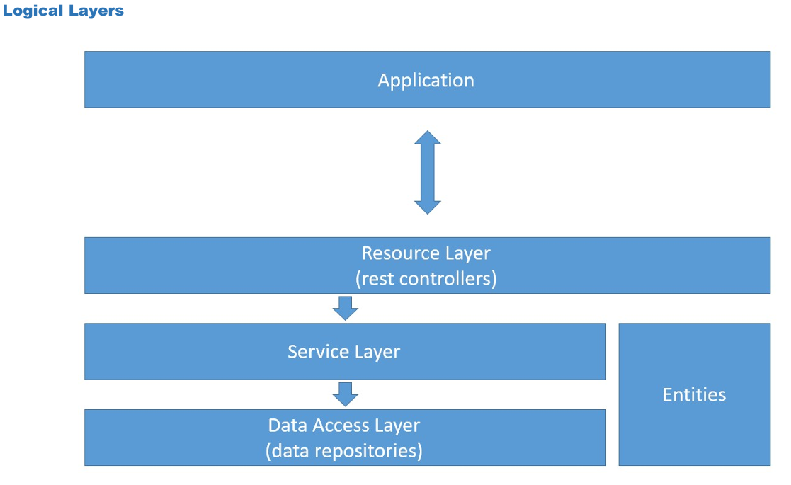

<h1 align="center">🔗 Projeto web services com Spring Boot e JPA / Hibernate </h1>

<h2 align="center">Curso Udemy: Programação Orientada a Objetos com Java</h2>

Este projeto faz parte do curso de Programação Orientada a Objetos com Java, ministrado na Udemy. O objetivo principal foi criar uma aplicação web utilizando Spring Boot e JPA / Hibernate, estruturando o sistema em camadas lógicas e implementando operações básicas de CRUD (Create, Retrieve, Update, Delete). Durante o desenvolvimento, diversas técnicas foram aplicadas para configurar e manipular um banco de dados de teste (H2), povoar o banco de dados e tratar exceções de forma eficiente.

## 📌 Objetivos
- Criar projeto Spring Boot Java 
- Implementar modelo de domínio 
- Estruturar camadas lógicas: resource, service, repository 
- Configurar banco de dados de teste (H2) 
- Povoar o banco de dados 
- Implementar operações CRUD (Create, Retrieve, Update, Delete) 
- Realizar o tratamento de exceções

## Modelo de domínio utilizado no projeto


## Instância de Domínio


## Camadas Lógicas



## 🗂️ Project Setup
### Project created
**Checklist:**
- Spring Initializr
  - Maven
  - Java 17
  - Packing JAR
  - Dependencies: Spring Web, JPA, devtools, h2 e postgresql

### User entity and resource
**Basic entity checklist:**
- Basic attributes
- Associations (instantiate collections)
- Constructors
- Getters & Setters (collections: only get)
- hashCode & equals
- Serializable

### H2 database, test profile, JPA
**Checklist:**
- JPA & H2 dependencies
- `application.properties`
- `application-test.properties`
- Entity: JPA mapping

**Dependencies:**
```xml
<dependency>
  <groupId>org.springframework.boot</groupId>
  <artifactId>spring-boot-starter-data-jpa</artifactId>
</dependency>
<dependency>
  <groupId>com.h2database</groupId>
  <artifactId>h2</artifactId>
  <scope>runtime</scope>
</dependency>
```
**application.properties:**

```properties
spring.profiles.active=test
spring.jpa.open-in-view=true
```

**application-test.properties:**

```properties
# DATASOURCE
spring.datasource.driverClassName=org.h2.Driver
spring.datasource.url=jdbc:h2:mem:testdb
spring.datasource.username=sa
spring.datasource.password=
# H2 CLIENT
spring.h2.console.enabled=true
spring.h2.console.path=/h2-console
# JPA, SQL
spring.jpa.database-platform=org.hibernate.dialect.H2Dialect
spring.jpa.defer-datasource-initialization=true
spring.jpa.show-sql=true
spring.jpa.properties.hibernate.format_sql=true
```

## 📋 Checklist Resumido do projeto

- `UserRepository` extends `JPARepository<User, Long>`
- Configuração da classe para o perfil "test"
- `@Autowired UserRepository`
- Instanciar objetos na memória
- Persistir objetos
- Registrar camada de serviço e componentes
- Nova entidade básica:
  - Entidade (associações "To many", lazy loading, `JsonIgnore`)
  - Repositório
  - Seed
  - Serviço
  - Recurso
- `OrderStatus` enum
- Associação muitos-para-muitos com `JoinTable`
- `OrderItem`, associação muitos-para-muitos com atributos extras:
  - `OrderItemPK`
  - `OrderItem`
  - Associação one-to-many com `Order`
  - Seed
- Associação one-to-many com `Product-OrderItem`
- Associação one-to-one com `Payment`
- Métodos `Subtotal` e `Total`

## 📁 Estrutura do Projeto
```java
src/
└── main/
    └── java/
        └── com/
            └── tutorial/
                └── web_services/
                    ├── config/
                    │   └── (configurações gerais da aplicação)
                    ├── entities/
                    │   ├── enums/
                    │   │   └── (definições de enumeradores usados nas entidades)
                    │   ├── pk/
                    │   │   └── (chaves primárias compostas)
                    │   ├── Category.java (entidade de categorias)
                    │   ├── Order.java (entidade de pedidos)
                    │   ├── OrderItem.java (itens de um pedido)
                    │   ├── Payment.java (entidade de pagamentos)
                    │   ├── Product.java (entidade de produtos)
                    │   └── User.java (entidade de usuários)
                    ├── repositories/
                    │   └── (interfaces para persistência de dados)
                    ├── resources/
                    │   ├── exceptions/
                    │   │   └── (tratamento de exceções específicas)
                    │   ├── CategoryResource.java (controle de recursos de categorias)
                    │   ├── OrderResource.java (controle de recursos de pedidos)
                    │   ├── ProductResource.java (controle de recursos de produtos)
                    │   └── UserResource.java (controle de recursos de usuários)
                    ├── services/
                    │   ├── exceptions/
                    │   │   ├── DatabaseException.java (exceção para erros no banco de dados)
                    │   │   └── ResourceNotFoundException.java (exceção para recursos não encontrados)
                    │   ├── CategoryService.java (lógica de negócio de categorias)
                    │   ├── OrderService.java (lógica de negócio de pedidos)
                    │   ├── ProductService.java (lógica de negócio de produtos)
                    │   └── UserService.java (lógica de negócio de usuários)
                    └── WebServicesApplication.java
                        (classe principal da aplicação)
    └── resources/
        ├── static/
        │   └── (arquivos estáticos da aplicação)
        ├── templates/
        │   └── (templates para exibição)
        ├── application-dev.properties (configurações para ambiente de desenvolvimento)
        ├── application-prod.properties (configurações para ambiente de produção)
        ├── application-test.properties (configurações para ambiente de teste)
        └── application.properties (configurações gerais da aplicação)
```

**Objects:**
```java
Category cat1 = new Category(null, "Electronics");
Category cat2 = new Category(null, "Books");
Category cat3 = new Category(null, "Computers");

Product p1 = new Product(null, "The Lord of the Rings", "Lorem ipsum dolor sit amet, consectetur.", 90.5, "");
Product p2 = new Product(null, "Smart TV", "Nulla eu imperdiet purus. Maecenas ante.", 2190.0, "");
Product p3 = new Product(null, "Macbook Pro", "Nam eleifend maximus tortor, at mollis.", 1250.0, "");
Product p4 = new Product(null, "PC Gamer", "Donec aliquet odio ac rhoncus cursus.", 1200.0, "");
Product p5 = new Product(null, "Rails for Dummies", "Cras fringilla convallis sem vel faucibus.", 100.99, "");

categoryRepositoy.saveAll(Arrays.asList(cat1, cat2, cat3));
productRepository.saveAll(Arrays.asList(p1, p2, p3, p4, p5));

p1.getCategories().add(cat2);
p2.getCategories().add(cat1);
p2.getCategories().add(cat3);
p3.getCategories().add(cat3);
p4.getCategories().add(cat3);
p5.getCategories().add(cat2);

productRepository.saveAll(Arrays.asList(p1, p2, p3, p4, p5));

User u1 = new User(null, "Maria Brown", "maria@gmail.com", "988888888", "123456");
User u2 = new User(null, "Alex Green", "alex@gmail.com", "977777777", "123456");

Order o1 = new Order(null, Instant.parse("2019-06-20T19:53:07Z"), OrderStatus.PAID, u1);
Order o2 = new Order(null, Instant.parse("2019-07-21T03:42:10Z"), OrderStatus.WAITING_PAYMENT, u2);
Order o3 = new Order(null, Instant.parse("2019-07-22T15:21:22Z"), OrderStatus.WAITING_PAYMENT, u1);

userRepository.saveAll(Arrays.asList(u1, u2));
orderRepository.saveAll(Arrays.asList(o1, o2, o3));

OrderItem oi1 = new OrderItem(o1, p1, 2, p1.getPrice());
OrderItem oi2 = new OrderItem(o1, p3, 1, p3.getPrice());
OrderItem oi3 = new OrderItem(o2, p3, 2, p3.getPrice());
OrderItem oi4 = new OrderItem(o3, p5, 2, p5.getPrice());

orderItemRepository.saveAll(Arrays.asList(oi1, oi2, oi3, oi4));

Payment pay1 = new Payment(null, Instant.parse("2019-06-20T21:53:07Z"), o1);
o1.setPayment(pay1);

orderRepository.save(o1);
```
**Exemplos de `JSON` retornado após estabelecer relações entre `User`, `Product`, `Category`, `OrderItem`, `Order` e `Payment`**
```json
[
    {
        "id": 1,
        "name": "Electronics"
    },
    {
        "id": 2,
        "name": "Books"
    },
    {
        "id": 3,
        "name": "Computers"
    }
]

{
    "id": 1,
    "name": "The Lord of the Rings",
    "description": "Lorem ipsum dolor sit amet, consectetur.",
    "price": 90.5,
    "imgUrl": "",
    "categories": [
        {
            "id": 2,
            "name": "Books"
        }
    ]
}

{
    "id": 1,
    "moment": "2019-06-20T19:53:07Z",
    "orderStatus": "PAID",
    "client": {
        "id": 1,
        "name": "Maria Brown",
        "email": "maria@gmail.com",
        "phone": "988888888",
        "password": "123456"
    },
    "items": [
        {
            "quantity": 2,
            "price": 90.5,
            "product": {
                "id": 1,
                "name": "The Lord of the Rings",
                "description": "Lorem ipsum dolor sit amet, consectetur.",
                "price": 90.5,
                "imgUrl": "",
                "categories": [
                    {
                        "id": 2,
                        "name": "Books"
                    }
                ]
            },
            "subTotal": 181.0
        },
        {
            "quantity": 1,
            "price": 1250.0,
            "product": {
                "id": 3,
                "name": "Macbook Pro",
                "description": "Nam eleifend maximus tortor, at mollis.",
                "price": 1250.0,
                "imgUrl": "",
                "categories": [
                    {
                        "id": 3,
                        "name": "Computers"
                    }
                ]
            },
            "subTotal": 1250.0
        }
    ],
    "payment": {
        "id": 1,
        "moment": "2019-06-20T21:53:07Z"
    },
    "total": 1431.0
}
```
## 🔧 User Operations

**Checklist:**
- `UserService`
- `UserResource`

**Operações:**
1. **Inserir Usuário**
    - Exemplo de Teste:
    ```json
    {
        "name": "Bob Brown",
        "email": "bob@gmail.com",
        "phone": "977557755",
        "password": "123456"
    }
    ```

2. **Excluir Usuário**
    - Sem parâmetros adicionais.

3. **Atualizar Usuário**
    - Exemplo de Teste:
    ```json
    {
        "name": "Bob Brown",
        "email": "bob@gmail.com",
        "phone": "977557755"
    }
    ```

4. **Buscar Usuário por ID**
    - Parâmetro: `id`

5. **Listar Todos os Usuários**
    - Sem parâmetros adicionais.

## ⚠️ Exception Handling

### Exception Handling - findById
**Checklist:**
- NEW CLASS: `services.exceptions.ResourceNotFoundException`
- NEW CLASS: `resources.exceptions.StandardError`
- NEW CLASS: `resources.exceptions.ResourceExceptionHandler`
- `UserService`

### Exception Handling - delete
**Checklist:**
- NEW CLASS: `services.exceptions.DatabaseException`
- `ResourceExceptionHandler`
- `UserService`
  - `EmptyResultDataAccessException`
  - `DataIntegrityViolationException`

### Exception Handling - update
**Checklist:**
- `UserService`
  - `EntityNotFoundException`

## 🚀 Tecnologias utilizadas

- Java
- Spring Boot
- JPA / Hibernate
- H2 Database e Postgres SQL 
- Maven
- Postman

## 📌 Sobre o Projeto

Este projeto de web services com Spring Boot e JPA / Hibernate foi desenvolvido em Java como parte do curso ministrado pelo professor  [Nélio Alves](https://github.com/acenelio), com o objetivo de proporcionar uma formação prática e completa em desenvolvimento de software.

**Objetivos do Projeto**

O principal objetivo deste projeto é desenvolver uma aplicação web robusta, utilizando Spring Boot e JPA/Hibernate para gerenciar um banco de dados relacional. Durante o desenvolvimento, diversos conceitos e técnicas avançadas são abordados, incluindo:

- **Programação Orientada a Objetos (POO):** Aplicação dos conceitos fundamentais de POO para criar um modelo de domínio estruturado e eficiente.
- **JPA (Java Persistence API):** Configuração e uso de JPA para mapear entidades e gerenciar o banco de dados.
- **Spring Boot:** Utilização do framework Spring Boot para criar e configurar a aplicação web de forma rápida e simplificada.
- **Banco de Dados H2:** Configuração de um banco de dados de teste em memória (H2) para desenvolvimento e testes rápidos.
- **Operações CRUD:** Implementação de operações básicas de CRUD (Create, Retrieve, Update, Delete) para gerenciar os dados da aplicação.
- **Tratamento de Exceções:** Implementação de mecanismos de tratamento de exceções para garantir a robustez e segurança da aplicação.
- **Associações entre Entidades:** Gerenciamento de relações complexas entre entidades, incluindo associações muitos-para-muitos e um-para-um.
- **Integração com Spring Data JPA:** Utilização de repositórios Spring Data JPA para simplificar o acesso aos dados.

**Desenvolvimento**

Durante o desenvolvimento deste projeto, foram exploradas diversas técnicas e práticas essenciais para criar uma aplicação web eficiente e escalável:
- **Criação e Configuração do Projeto:** Uso do Spring Initializr para configurar o projeto com as dependências necessárias.
- **Modelagem de Domínio:** Implementação de um modelo de domínio abrangente e bem definido para representar os dados da aplicação.
- **Estruturação de Camadas Lógicas:** Organização do código em camadas lógicas claras (resource, service, repository) para melhorar a manutenção e escalabilidade.
- **Seed de Banco de Dados:** Povoamento do banco de dados com dados iniciais para facilitar o desenvolvimento e testes.
- **Operações CRUD:** Implementação de métodos para criar, recuperar, atualizar e deletar dados no banco de dados.
- **Associações entre Entidades:** Configuração de relações entre entidades, como categorias e produtos, pedidos e itens de pedido, etc.
- **Interface de Exibição:** Ajustes na interface de exibição para proporcionar uma melhor experiência visual e usabilidade.

**Conclusão**

Esse projeto apresenta uma base sólida para a criação de Web Services com Spring Boot, incluindo uma aplicação web funcional e robusta, capaz de gerenciar dados de forma eficiente e segura. As técnicas e práticas aplicadas durante o desenvolvimento proporcionam uma base sólida para projetos futuros e preparam os desenvolvedores para desafios reais no desenvolvimento de software.

Em resumo, este projeto foi uma excelente oportunidade para aprofundar os conhecimentos em POO, JPA, Spring Boot e práticas de desenvolvimento de software, sob a orientação do professor [Nélio Alves](https://github.com/acenelio).

#### 📌 Autor

👨‍💻 **Albert Silva**
